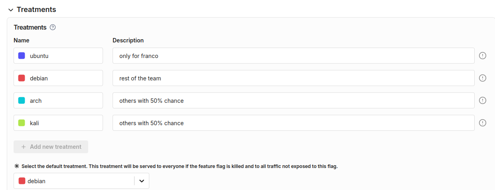
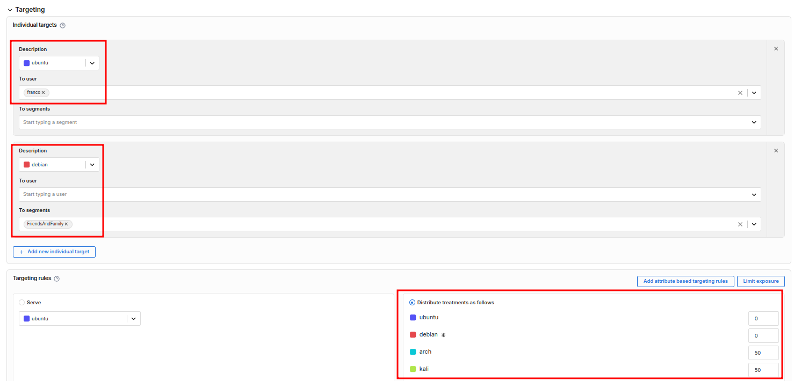
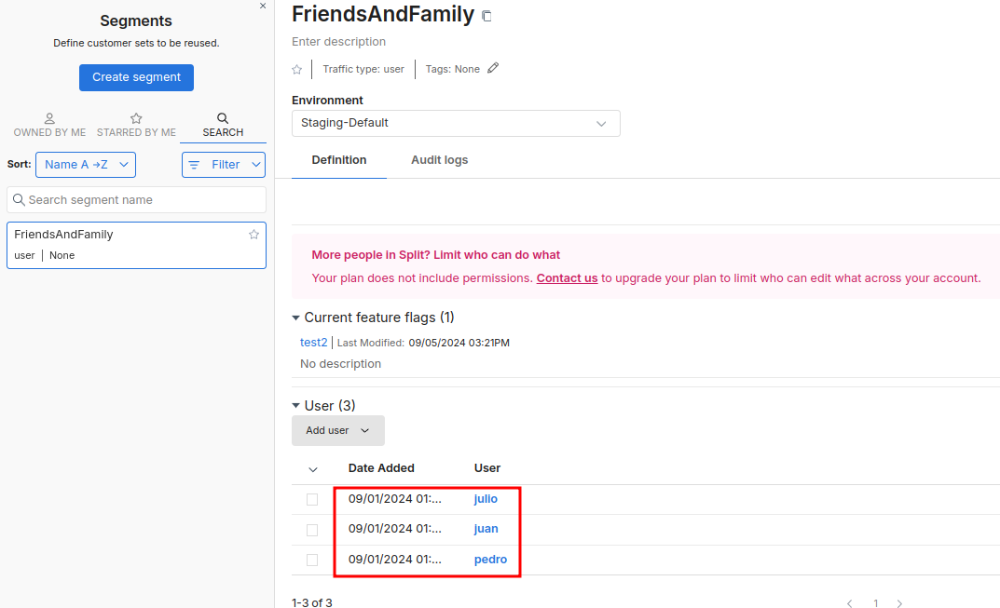
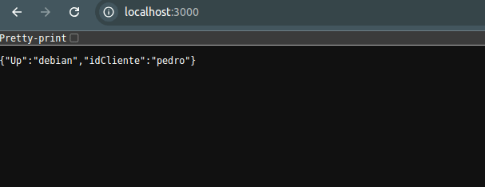

```markdown
# Feature Flags Demo with Split SDK

## Project Overview
This is a demonstration project that implements feature flags using the Split SDK. The project consists of a simple Node.js server that serves different responses based on feature flag treatments assigned to different users.

---

## Architecture Components

### 1. Server Application
- **Framework**: Built using the Fastify framework.
- **Feature Flag Integration**: Integrates with Split SDK for feature flag management.
- **Port**: Runs on port `3000`.
- **Containerization**: Containerized using Docker.

### 2. Feature Flag Implementation
- **SDK**: Utilizes Split.io's SDK for feature flag management.
- **User Management**:
  - Uses a predefined list of user IDs (`franco`, `juan`, `pedro`, etc.).
  - Randomly selects a user ID for each request.
- **Treatment Options**:
  - `ubuntu`
  - `debian`
  - `arch`
  - `kali`
  - `control` (default fallback)

### 3. Project Structure
- **Main Application File**: `app/server.js`
- **Alternative Implementation**: `app/featureFlagService.js` (development version)
- **Configuration Files**:
  - `package.json`: Dependencies and scripts.
  - `.env`: Environment variables (not tracked in git).
  - Docker-related files for containerization.

---

## How It Works

### Initialization
1. The application loads environment variables.
2. Initializes the Split SDK with:
   - API key.
   - Feature flag ID.
3. Sets up a Fastify server.

### Request Handling
1. Requests to the root endpoint (`/`) trigger the following process:
   - A random user ID is selected from the predefined list.
   - The Split SDK evaluates the treatment for the selected user.
   - Returns a JSON response with:
     - Treatment result.
     - User ID.

### Environment Configuration
- Sensitive data such as the Split API key is stored in environment variables.
- Feature flag IDs are configurable via `.env`.

### Containerization
- Docker setup ensures consistent deployment.
- Uses `Node.js 18 Alpine` as the base image.
- Development support includes volume mounting for live-reload.

### Split Web Platform Configurations

#### Treatments


#### Targeting


#### Friends and Family segment



#### Demo



Here we can see how the responses match the configured treatments, users and groups.
Split responds with :
* "Ubuntu" treatment for the id "franco"
* "Debian" treatment for members of the friend and family segment
* "Kali" or "Arch" with 50% chance for othe id's

---

## Key Features

### Split SDK Integration
- Handles **SDK ready events**.
- Configurable timeout for SDK initialization.
- Evaluates treatments based on user IDs.

### Security
- Utilizes environment variables to safeguard sensitive data.
- Ensures only production dependencies are included in the Docker build.

### Development Experience
- Hot-reload capability through volume mounting.
- Well-structured project organization.
- Docker Compose simplifies development setup.

---

## Deployment

The application can be deployed using Docker with the following options:

1. **Direct Docker Build**:
   - Uses the `Dockerfile` for building and deploying the application.

2. **Docker Compose**:
   - Simplifies setup for a development environment.

---

## Important Notes

1. Split SDK configuration:
   - Includes a **1.5-second timeout** for initialization.

2. Stateless design:
   - Optimized for containerized environments.

3. Ensure environment variables are correctly configured before deployment.

---

## Difficulties
- Before using a list of client IDs, the id was generated with crypto.randomUUID(), but this caused a different treatment for each request, so we decided to use a list of predefined client IDs, and the response 

## Conclusion
This project demonstrates how to implement feature flags in a Node.js application using the Split SDK. It adheres to best practices for both development and production environments, emphasizing scalability, security, and ease of deployment.
```
